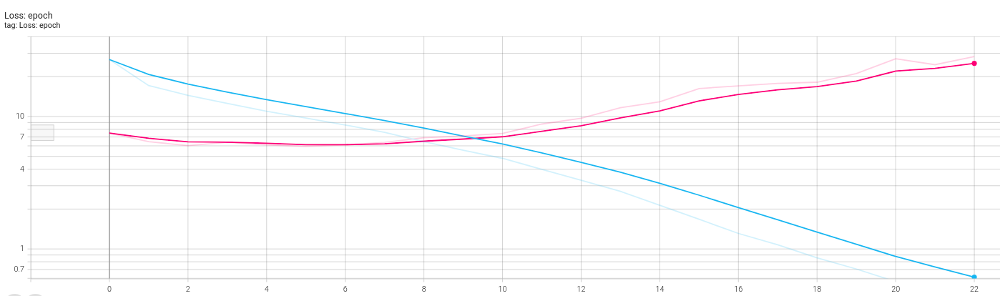
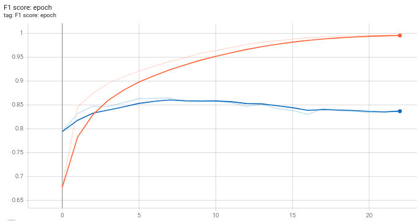
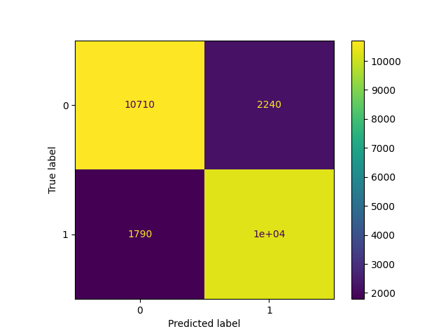
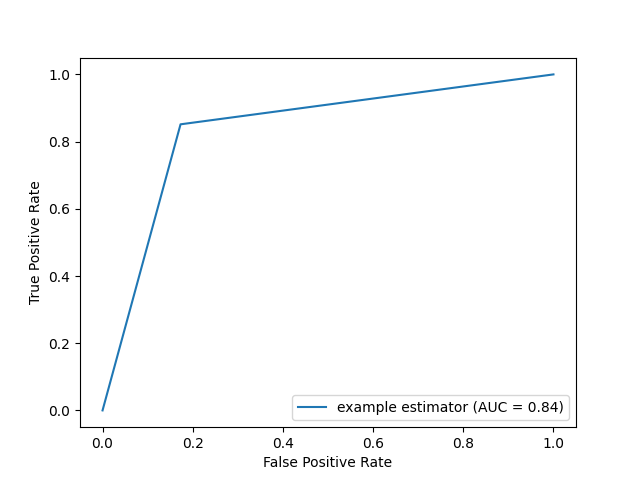
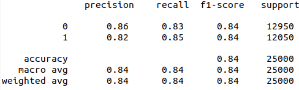

# Text Classification
Text classification task was implemented with using LSTM with Attention mechanism.
In order to train the neural network the IMDB dataset was used. 

### Training process
Model was training more than 20 epochs. 
**After the 10 epoch overfitting was appeared.** 

After performing 10 training epochs next results were received:
 * Accuracy and F1 score equal to **95** on training dataset
 * Accuracy and F1 score equal to **86** on validation dataset

### Received results

Trained model was tested on validation dataset. 
In order to better understand the weaknesses of the model the confusion matrix and ROC AUC curve were built. 

On top of that, the classification report was printed.

